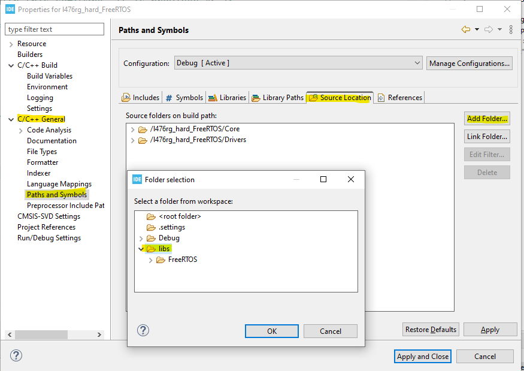
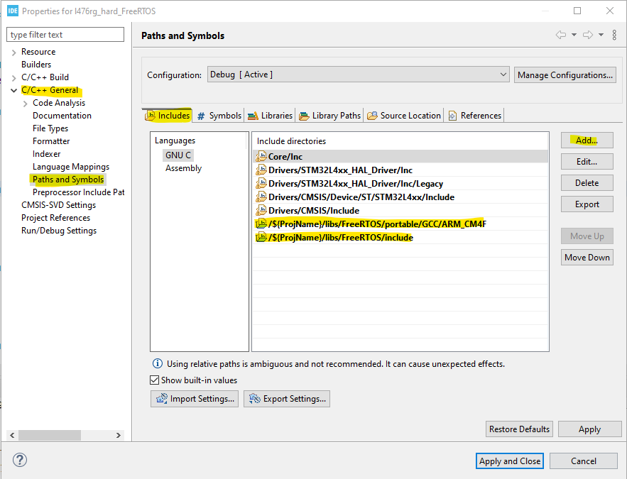
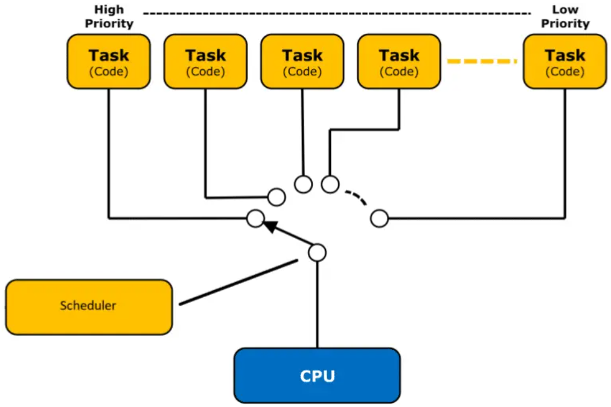
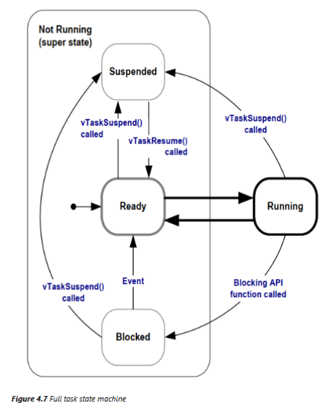

# Curso FreeRTOS Essencial com STM32

Este repositório contém minhas anotações, exercícios e códigos de exemplo do treinamento **FreeRTOS Essencial com STM32**, ministrado pelo instrutor **Pablo Jean Rozario**. O curso está disponível na Udemy no seguinte [link](https://www.udemy.com/course/freertos-essencial/?couponCode=ST6MT60525G3).

Aqui, você encontrará recursos úteis para entender melhor o funcionamento do FreeRTOS em conjunto com microcontroladores STM32, incluindo a documentação oficial, exemplos práticos e referências externas.

---

## Índice

1. [Documentação e Ferramentas](#documentação-e-ferramentas)
2. [Módulos do Curso](#módulos)
3. [Exercícios e Códigos de Exemplo](#exercícios-e-códigos-de-exemplo)

---

## Documentação e Ferramentas

Aqui estão algumas das principais ferramentas e documentos necessários para o desenvolvimento com STM32 e FreeRTOS:

- **HAL (Hardware Abstraction Layer) disponibilizado pela ST**: [Documentação HAL](https://www.st.com/content/st_com/en/search.html#q=hardware%20abstraction%20layer%20-t=resources-page=1)
- Opções de placas da ST: [NUCLEO-G474RE](https://www.st.com/en/evaluation-tools/nucleo-g474re.html), [NUCLEO-L476RG](https://www.st.com/en/evaluation-tools/nucleo-l476rg.html#overview), [NUCLEO-H755ZI-Q](https://www.st.com/en/evaluation-tools/nucleo-h755zi-q.html#overview), etc.
- **Site Oficial do FreeRTOS**: https://www.freertos.org/

### Ferramentas de Desenvolvimento

- **[STM32Cube GitHub](https://github.com/STMicroelectronics)**: Repositório oficial com diversas ferramentas e bibliotecas.
- **[STM32CubeIDE - Portal de Recursos](https://wiki.st.com/stm32mcu/index.php?title=STM32CubeIDE:Introduction_to_STM32CubeIDE&sfr=stm32mcu)**: Portal de recursos para o STM32CubeIDE.

---

## Módulos

Este curso é dividido em 10 módulos principais, que cobrem desde a introdução ao FreeRTOS até conceitos mais avançados de sincronização e comunicação entre tarefas.

### 1. [Introdução ao Curso FreeRTOS Essencial](#1-introdução-ao-curso-freertos-essencial)

### 2. [Introdução ao FreeRTOS](#2-introdução-ao-freertos)
 - **Principais Características:**
    - Core em tempo real
    - Kernel leve
    - Gerenciamento (sincronização e comunicação) de Tasks
    - Times
    - Gerenciamento de Memoria
    - Multiplataforma

### 3. [Documentação e Padronização do FreeRTOS](#3-documentação-e-padronização-do-freertos)

- [FreeRTOS Documentation](https://www.freertos.org/Documentation/00-Overview)

- [Books and manual](https://www.freertos.org/Documentation/02-Kernel/07-Books-and-manual/01-RTOS_book)

- [Supported Devices](https://www.freertos.org/Documentation/02-Kernel/03-Supported-devices/00-Supported-devices)

- **Convenções**
 
    - Para variáveis:

        

        

    - Para funções:

        

    - Para macros: Sempre escrita em *upper case*, exceto o seu prefixo.

        

- **Estrutura dos diretórios**
    ```bash
    ├── Root
    │   ├── examples
    │   ├── include
    |   |   ├── FreeRTOS.h
    |   |   ├── task.h
    |   |   ├── timers.h
    |   |   └── ...
    │   └── portable
    |       ├── MenMang
    |       └── {Compiler}/{Core}
    ```

### 4. [Instalando o FreeRTOS no Microcontrolador](#4-instalando-o-freertos-no-microcontrolador)

- **Método 1 (Easy):** através no STMCubeIDE (CMSIS-RTOS)

    

    - Habilitar:

        
    
        **Importante:** Em ``SYS Mode Configuration``, utilize um ``Timebase Source`` diferente do ``SysTick``, pois esse será exclusivo do FreeRTOS. E em ``Advanced settings``, deixe o ``USE_NEWLIB_REENTRANT`` habilitado.

- **Método 2 (Hard):** importando do projeto no Github e instalando manualmente. 

    1. **Criar o projeto e configurar o ``SysTick``:**

        Crie um novo projeto no STMCubeIDE, e em ``SYS Mode Configuration``, utilize um ``Timebase Source`` diferente do ``SysTick``. 

    2. **Download do FreeRTOS:**

        No repositório do [GitHub do FreeRTOS](https://github.com/FreeRTOS/FreeRTOS-Kernel), baixe/clone o kernel no diretório do projeto.

        **Obs.:** Delete ou configure o compilador para ignorar os arquivos ``cmake_example`` e ``coverity`` do diretório **``/examples``**, caso existam, para evitar erros de compilação.

    3. **Remover os arquivos desnecessários do diretório `/portable`**

        O diretório `/portable` contém diversos compiladores, porém **devemos manter apenas o compilador `GCC`**, pois é o utilizado pelo **STM32CubeIDE**. Também devemos manter o diretório `MemMang`, que contém os arquivos responsáveis pelo gerenciamento de **memória dinâmica e estática** do microcontrolador. **Todos os demais diretórios dentro de `/portable` devem ser removidos**.

        Para confirmar qual compilador está sendo usado no STM32CubeIDE, acesse as **`Properties`** do projeto, vá até **`C/C++ Build` > `Settings`** e verifique os campos correspondentes:

        

        Dentro de `/portable/GCC`, há suporte para várias arquiteturas de microcontroladores. Como o projeto utiliza a placa **NUCLEO-L476RG**, que possui um microcontrolador **ARM Cortex-M4 de 32 bits com FPU (suporte a ponto flutuante)**, devemos **manter apenas o diretório `ARM_CM4F`** e remover os demais.

        No diretório `/portable/MemMang`, **mantenha apenas o arquivo `heap_4.c`**, que é o gerenciador de heap recomendado para a maioria dos casos. Os outros arquivos podem ser excluídos.

        Ao final, a estrutura do diretório `/portable` deve ficar da seguinte forma:

        ```bash
        ├── portable
        │   ├── GCC
        │   │   └── ARM_CM4F
        │   │       ├── port.c
        │   │       └── portmacro.h
        │   ├── MemMang
        │   │   ├── heap_x.c
        │   │   └── ReadMe           
        │   ├── CMakeLists.txt
        │   └── readme.txt
        ```

    4. **Indicar os caminhos de compilação**
        Para que o **STMCubeIDE** encontre esses os arquivos, em **`Properties`** do projeto, vá até **`C/C++ General` > `Path and Symbols` > `Source Location`** e 
        adicione o caminho para a o diretório onde o FreeRTOS foi baixado/clonado, como indicado abaixo:

        

        Depois, ainda em **`C/C++ General` > `Path and Symbols`**, vá em **`Includes`** e 
        adicione o caminho para a o diretório **`/portable/GCC/ARM_CM4F`** e para o **`/include`**, como indicado abaixo:

        

    5. **Copiar a template ``FreeRTOSConfig.h``**

        No diretório **``/examples/template_configuration``**, copie o arquivo `FreeRTOSConfig.h` para o diretório **`/{ProjName}/Core/Inc`**.

        No arquivo `FreeRTOSConfig.h` do diretório **`/{ProjName}/Core/Inc`**,  temos que realizar algumas configurações:

        |Configuração|Descrição|Def p/ o NUCLEO-L476RG|
        |:---|:---|:---:|
        |`configCPU_CLOCK_HZ`|Frequência do clock|`SystemCoreClock`*|
        |`configUSE_TIME_SLICING`|Permite que o scheduler alterne entras as tasks em estado ponto|1|
        |`configTICK_TYPE_WIDTH_IN_BITS`|Tamanho da variável `TickType_t`|`TICK_TYPE_WIDTH_32_BITS`*|
        |`configCHECK_HANDLER_INSTALLATION`||0|
        |`configCHECK_FOR_STACK_OVERFLOW`||0|
        |`configMAX_API_CALL_INTERRUPT_PRIORITY`|Nível de prioridade mais alto que chamadas do FreeRTOs podem utilizar das disponíveis pelo microcontrolador*|`configMAX_SYSCALL_INTERRUPT_PRIORITY`|
        |`configMAX_SYSCALL_INTERRUPT_PRIORITY`||`( configLIBRARY_MAX_SYSCALL_INTERRUPT_PRIORITY << (8 - configPRIO_BITS) )`*|
        |`configKERNEL_INTERRUPT_PRIORITY`||`( configLIBRARY_MAX_SYSCALL_INTERRUPT_PRIORITY << (8 - configPRIO_BITS) )`*|

        \* Importe o arquivo `stm32l476xx.h` para ter acesso a variável `SystemCoreClock` que contem a frequência do clock configurada.

        \* O valor `xx` de `TICK_TYPE_WIDTH_xx_BITS` deve ser definido de acordo com a arquitetura do microcontrolador.

        \* O [STM32L476RG](https://www.st.com/resource/en/datasheet/stm32l476rg.pdf) usa 4 bits para os níveis de prioridade, tendo assim existem 16 níveis de interrupção. Crie a variável `configPRIO_BITS` que deve buscar em `__NVIC_PRIO_BITS` o número de bits para os níveis de prioridade do microcontrolador.

        \* Inclua no  `FreeRTOSConfig.h` o seguinte trecho de código:

        ~~~c++
        /******************************************************************************/
        /* Interrupt nesting behaviour configuration. *********************************/
        /******************************************************************************/

        /* Cortex-M specific definitions. */
        #ifdef __NVIC_PRIO_BITS
        /* __BVIC_PRIO_BITS will be specified when CMSIS is being used. */
        #define configPRIO_BITS         __NVIC_PRIO_BITS
        #else
        #define configPRIO_BITS         4
        #endif

        #define configLIBRARY_LOWEST_INTERRUPT_PRIORITY   		15

        #define configLIBRARY_MAX_SYSCALL_INTERRUPT_PRIORITY 	5
        #define configKERNEL_INTERRUPT_PRIORITY          ( configLIBRARY_MAX_SYSCALL_INTERRUPT_PRIORITY << (8 - configPRIO_BITS) )
        ~~~

    6. **Configurar as interrupções (``SysTick``, ``SVC``, ``PendSV``) e o ``FreeRTOSConfig.h``.**

        Em `/{ProjName}/Core/Src/stm32l4xx_it.c` temos todas as funções de tratamento de interrupções que são geradas pelo microcontrolador e entre elas temos: `SVC_Handler`, `PendSV_Handler` e `SysTick_Handler`.

        Em `/{ProjName}/libs/FreeRTOS/portable/GCC/ARM_CM4F/port.c`, temos os protótipos da *exception handlers*: `xPortPendSVHandler`, `xPortSysTickHandler` e `vPortSVCHandler`. Copie as mesmas para o `stm32l4xx_it.c` e as chame dentro de sua respectiva funções de tratamento:
        
        ~~~c++
        /* Private function prototypes -----------------------------------------------*/
        /* USER CODE BEGIN PFP */
        void xPortPendSVHandler( void );
        void xPortSysTickHandler( void );
        void vPortSVCHandler( void );
        /* USER CODE END PFP */
        // ...
        void SVC_Handler(void){
            vPortSVCHandler();
        }
        // ...
        void PendSV_Handler(void){
            xPortPendSVHandler();
        }
        // ...
        void SysTick_Handler(void){
            xPortSysTickHandler();
        }
        ~~~


### 5. [Entendendo as Tarefas (Tasks)](#5-entendendo-as-tarefas-tasks)



**Estados das Tasks**
- ***Running***: Tarefas em execução, usando a CPU.
- ***Ready***: Tarefas prontas para executar, estão na fila para ter acesso a CPU.
- ***Blocked***: Tarefa bloqueada, esperando o resultado ou a ocorrência de um evento externo.
- ***Suspended***: Tarefa suspensa, determinada pela implementação da aplicação.

    

**Task API**
|Função|Descrição|
|:---|:---|
|`xTaskCreate()`|Cria um nova tarefa com alocação de memoria dinâmica|
|`vTaskDelete()`|Deleta uma tarefa do *schedular* e libera os recursos|
|`vTaskDelay()`|Deixa a tarefa no estado de *blocked* por um tempo predefinido|
|`vTaskDelayUntil()`|Similar ao `vTaskDelay()`, mas com uma frequência fixa|
|`vTaskSuspend()`|Deixa a tarefa no estado de *suspended* por um tempo indefinido|
|`vTaskResume()`|Tira a tarefa no estado de *suspended*|

**Documentação Base:**
- [Task Creation](https://www.freertos.org/Documentation/02-Kernel/04-API-references/01-Task-creation/00-TaskHandle)
- [Task Utilities](https://www.freertos.org/Documentation/02-Kernel/04-API-references/03-Task-utilities/00-Task-utilities)
- [Task Control](https://www.freertos.org/Documentation/02-Kernel/04-API-references/02-Task-control/00-Task-control)

### 6. [Entendendo as Filas (Queues)](#6-entendendo-as-filas-queues)

### 7. [Entendendo os Semáforos (Semaphores)](#7-entendendo-os-semaforos-semaphores)

### 8. [Entendendo as Gatekeeper Tasks](#8-entendendo-as-gatekeeper-tasks)

### 9. [Entendendo as Notificações de Tarefas (TaskNotify)](#9-entendendo-as-notificações-de-tarefas-tasknotify)

### 10. [Entendendo os Eventos (Event Groups)](#10-entendendo-os-eventos-event-groups)

---

## Exercícios e Códigos de Exemplo

Neste repositório, você também encontrará códigos de exemplo e atividades práticas para consolidar o aprendizado. Para visualizar os códigos e exercícios realizados durante o curso, acesse a pasta correspondentes nos seguinte diretório:

- `projetos/`: Exemplos práticos e atividades do curso.

